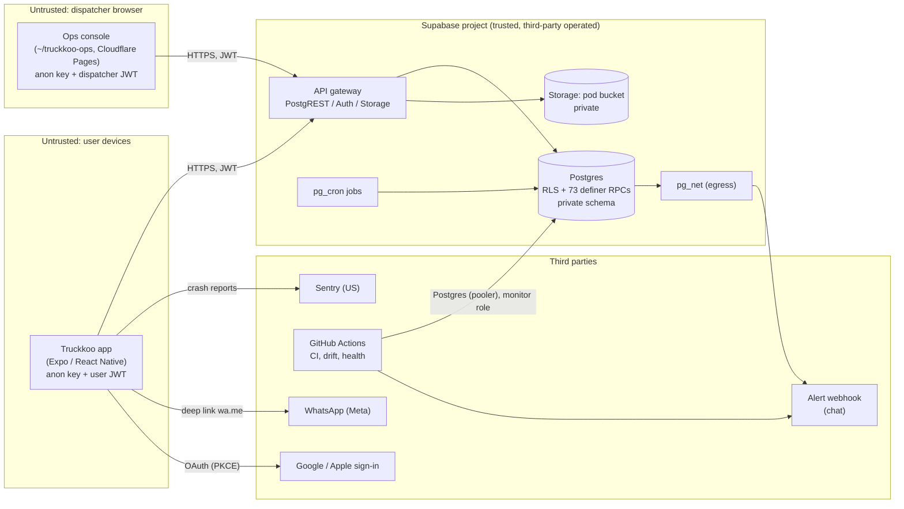

# Truckkoo — Threat Model

**As of 2026-09-27**, against `main` + migrations 0001–0037. Companion to
`SECURITY.md` (the rules) and `SENSITIVE_FIELDS.md` (the never-client-writable
register). `SECURITY.md` §1 is the short version of this document; this is the
long one — every component, both the application and the network, and what an
attacker can actually do today.

**How it was built.** Code and migrations read directly, not recalled. Claims
marked ✅ were verified on 2026-09-27 by querying a fresh local database built
from all 37 migrations, or by the three SQL suites (`npm run test:db`, all
passing). Claims marked ⚠️ could not be verified from this repository — usually
because they are dashboard settings or live in `~/truckkoo-ops` — and must be
checked by hand. The production findings come from Supabase's Security Advisor
output of 2026-09-27.

**What "secure" means here.** Zero risk is not on offer from anyone. The goal
is: (1) getting in is hard, (2) one mistake exposes little, (3) you hear about
it in minutes, (4) you know what to do next. Every finding below is judged on
those four.

---

## 1. Why this matters more than usual

- **Legal.** Oman's Personal Data Protection Law (Royal Decree 6/2022) and its
  2024 executive regulations likely apply. A breach of Omani personal data can
  carry penalties for the controller. Confirm scope with an Omani lawyer — this
  document is engineering, not legal advice.
- **Commercial.** The rate card and drivers' declared routes are the business.
  A competitor with either can undercut prices or poach supply.
- **Operational.** One developer, part-time. Every control below is judged on
  whether it keeps working without anyone watching it.

---

## 2. System and trust boundaries

| # | Boundary | What crosses it | Primary control |
|---|---|---|---|
| TB1 | Phone → Supabase API | Every read and write from shippers and drivers | RLS, column grants, definer RPCs that re-check `auth.uid()` |
| TB2 | Dispatcher browser → Supabase API | Cross-tenant reads, privileged writes | `private.require_ops()` in every `ops_*` RPC ✅; `ops_audit` log |
| TB3 | GitHub Actions → Postgres | Migration ledger, health, catalog reads | Restricted `truckkoo_monitor` role (⚠️ only if the secret actually uses it) |
| TB4 | Postgres → the internet | Alert text via pg_net | Allowlisted settings; only migration-controlled text in alerts ✅ |
| TB5 | App → Sentry | Crash reports | PII scrubbing, no default PII, no replay ✅ |
| TB6 | Developer → everything | Dashboard, GitHub, Expo, Cloudflare, Play Console | 2FA (⚠️ unverified) |

**There is no application server.** No Edge Functions exist and nothing uses
the service-role key ✅. That removes a whole class of server-side bugs, and
makes TB1 the whole API: the anon key and URL are public by design (they ship
in the app), so **anyone can call anything at TB1 with curl**. RLS and the
definer functions are the only thing between the internet and the data.

---

## 3. Assets

| Asset | Where | Sensitivity | Who may read |
|---|---|---|---|
| Rate card | `private.rate_cards` | Crown jewel — the moat | Dispatchers via `ops_rate_cards()` only; no client grant ✅ |
| Driver declared routes (legs) | `public.legs` | Crown jewel — supply intelligence | Owning driver; dispatchers via `ops_legs` |
| Phone numbers | `profiles.phone` | Personal data | Own row only ✅; trip counterpart via `trip_counterpart()` (participants only) |
| Names, cargo descriptions | `profiles`, `loads` | Personal / commercial | Owner; offered driver (cargo only); dispatchers |
| Driver positions | `trip_positions` | Personal data (location) | Latest fix only, trip participants, only while `in_transit` ✅; trail ops-only |
| Proof-of-delivery photos | Storage `pod` bucket | Personal / commercial | Trip participants + dispatchers; 60-second signed URLs ✅ |
| Auth credentials | Supabase Auth; device keychain | Account takeover | Refresh token in OS keychain via SecureStore ✅ |
| Security events | `private.security_events` | Contains IPs | No client grant ✅; swept after 90 days ✅ |
| Secrets | Supabase dashboard, GitHub secrets, EAS secrets | Full compromise | You |

---

## 4. Threat actors

| Actor | Access | Motive | Most likely move |
|---|---|---|---|
| Opportunistic attacker | Anon key, curl, free signups | Data to sell, bragging | Enumerate RPCs; try IDOR and mass assignment |
| Competitor | As above, plus money and patience | Rate card, driver supply, reputation | Throwaway accounts to sweep quotes; fake loads to waste dispatch; poach drivers |
| Registered shipper or driver | Legitimate account | Self-interest | Read others' loads; tamper with price or status; fake verification |
| Malicious or careless insider | Dispatcher account | Money, grudge | Bulk-read customers through `ops_*`; switch off the vetting gate |
| Account thief | Stolen password or session | Varies | Take over a dispatcher, or you |
| Supply-chain attacker | A compromised npm package or GitHub Action | Session tokens, secrets | Code running on users' phones or in CI |
| Platform failure | Supabase, Meta, Cloudflare | — | Outage, WhatsApp number ban, account lockout |

---

## 5. Application security (STRIDE per component)

Severity = likelihood × impact, judged for this business at its current size.
**C**ritical · **H**igh · **M**edium · **L**ow.

### 5.1 Authentication

| ID | Threat (STRIDE) | Current control | Gap | Sev |
|---|---|---|---|---|
| A1 | **S** Throwaway accounts at zero cost | Supabase auth limit: 30 sign-ups per 5 min per IP | **Email confirmation is off** (`enable_confirmations = false`); no captcha. Every per-account rate limit below is multiplied by free accounts | **H** |
| A2 | **S** Credential stuffing / weak passwords | Minimum 8 characters; auth rate limits | No complexity rule; **leaked-password protection off** (Advisor) | M |
| A3 | **E** Stolen session changes the password and locks the owner out | Refresh-token rotation on | `secure_password_change = false` — no recent sign-in required to change the password | M |
| A4 | **S** Stolen access token outlives sign-out or suspension | Sign-out is `scope: 'global'` ✅ | Access tokens are stateless JWTs valid for `jwt_expiry = 3600` (1 hour) after revocation | M |
| A5 | **I** Account enumeration at sign-up | "Already registered" maps to a generic sign-in failure ✅ | Timing and flow differences not assessed | L |
| A6 | **S** Hijacked email/reset link | PKCE: a code is useless without the verifier stored on the initiating device ✅ | Link lifetime `otp_expiry = 3600`; custom scheme `truckkoo://` is claimable by other Android apps (OPEN_ISSUES #3) | L |
| A7 | **S** Login CSRF via tokens in a URL | Tokens are accepted only from the result of a sign-in window the app opened ✅ | The implicit-flow fragment fallback in `exchangeReturnedUrl` is surface the PKCE app does not need | L |
| A8 | **S** Password reset leaves other sessions alive | — | OPEN_ISSUES #4, undecided | L |
| A9 | **R** No record of sign-in anomalies | Supabase Auth logs | Not alerted on; 7-day retention on Pro | M |

### 5.2 Authorization — RLS, grants, definer functions

| ID | Threat | Current control | Gap | Sev |
|---|---|---|---|---|
| Z1 | **I** IDOR: read another tenant's rows | RLS enabled **and forced** on every public table ✅; tenant-isolation suite in CI ✅ | A future table added without RLS — the most likely *future* leak. Guarded by the rule to extend `tenant_isolation.sql`, and now by the drift check on production | M |
| Z2 | **E** Mass assignment of role/status/price/ids | Column-level grants; `SENSITIVE_FIELDS.md` ✅ | — | L |
| Z3 | **E** Privilege escalation through a definer function | All 73 public definer functions pin `search_path = ''` ✅ (static check, ops suite §8); every `ops_*` calls `require_ops()` ✅ | — | L |
| Z4 | **E** Anonymous access to a definer function | None in the repo schema ✅ | **Production had one:** `public.rls_auto_enable()`, created by hand, callable without signing in (Advisor). Fixed by 0037 — **not yet applied** | **C** until applied |
| Z5 | **T** Hand-made production changes nobody reviewed | Drift check compares the migration ledger | Ledger-only until 2026-09-27; now also checks anon definers, RLS, and unknown functions — **only runs once `SUPABASE_DB_URL` is set** | H |
| Z6 | **I** The matching engine as a load board | `private.candidates_for` has no grant ✅ | — | L |
| Z7 | **I** GraphQL exposes schema shape | Grants still apply | `graphql_public` is exposed though the app never uses it | L |

### 5.3 Business logic

| ID | Threat | Current control | Gap | Sev |
|---|---|---|---|---|
| B1 | **I** Rate-card extraction by sweeping quotes | `quote_route` 30/hour, `estimate_route` 60/hour, per account; shipper-only | The card is priced per corridor band — 320 bands, so **one quote per band** reveals it: ~11 hours with one account at 30/hour, minutes with throwaway accounts (A1). Accepted by SECURITY.md §5 (a shipper must see a price); the lever left is the cost of an account (A1, row 8) and noticing a sweep (row 9) | **H** |
| B2 | **T** Price tampering / quote rebinding | Server recomputes; immutable, bound, expiring quotes ✅ (`pricing.sql`) | — | L |
| B3 | **T** Illegal status transitions | RPC-only transitions; no status grant ✅ | — | L |
| B4 | **D** Fake loads flooding dispatch | `post_load` 20/hour per account; suspension | Multiplied by free accounts (A1); no per-IP limit (SECURITY.md §11) | **H** (with A1) |
| B5 | **E** Self-verification as a driver | `verified_at` not client-writable ✅ | A dispatcher can switch off `require_verified_driver` — logged in `ops_audit`, **not alerted** | M |
| B6 | **T** Auto-dispatch widens who reads cargo | Tier-1 only; caps; kill switch (OPEN_ISSUES #24) | — | L |

### 5.4 Data exposure and privacy

| ID | Threat | Current control | Gap | Sev |
|---|---|---|---|---|
| D1 | **I** Phone numbers leaked | Own-row RLS on `profiles` ✅; counterpart phone only to trip participants | Phone stays visible after a trip ends (OPEN_ISSUES #22) | M |
| D2 | **I** Location tracking beyond the job | Stored only while `in_transit`, latest fix only ✅ | Dispatchers can read trails until swept | L |
| D3 | **I** PII in logs and crash reports | SECURITY.md §10; Sentry scrubbing ✅ | Names and cargo text cannot be detected by pattern; Sentry IP storage is a project setting (⚠️) | M |
| D4 | **I** Data kept longer than needed | Positions, client errors, security events are swept ✅ | No retention rule for old loads, profiles, photos | M |
| D5 | **I** Data leaving Oman | — | Supabase region, Sentry (US), Cloudflare, GitHub are all outside Oman — a PDPL question for the lawyer | M |

### 5.5 Mobile client

| ID | Threat | Current control | Gap | Sev |
|---|---|---|---|---|
| M1 | **I** Token theft from the device | Refresh token in keychain/keystore via SecureStore ✅ | Rooted devices: accepted risk | L |
| M2 | **I** App-data backup to the cloud | — | `android.allowBackup` is not set, and Expo's default allows backup; the booking draft (cities, cargo text) in AsyncStorage would travel with it | L |
| M3 | **T** Modified APK / API use without the app | Server-side enforcement ✅; tripwires ✅ | Expected; no client-side control is relied on | L |
| M4 | **I** WhatsApp deep-link injection / RTL spoofing | `safe-text.ts` + database trigger ✅ | — | L |
| M5 | **I** Crash-report quota abuse (the DSN is public) | Disabled in dev | Enable spike protection in Sentry (⚠️) | L |

### 5.6 Dispatcher console (`~/truckkoo-ops`)

| ID | Threat | Current control | Gap | Sev |
|---|---|---|---|---|
| O1 | **S** Stolen dispatcher password = every customer's data | `require_ops()`; `ops_audit`; rate limits on every write | **No second factor enforced** (`is_ops()` checks membership, not `aal2`); no Cloudflare Access | **H** |
| O2 | **E** A suspended dispatcher keeps their powers | — | `require_ops()` ignores `suspended_at`; only deleting from `private.ops_users` revokes it | M |
| O3 | **I** Bulk export by an insider | Rate limits on writes; audit | **Reads are not rate-limited or alerted** | M |
| O4 | **T** XSS or missing headers in the console | ⚠️ separate repo, not reviewed here | CSP, HSTS, frame-ancestors unverified | M ⚠️ |

### 5.7 Supply chain and CI/CD

| ID | Threat | Current control | Gap | Sev |
|---|---|---|---|---|
| S1 | **E** A malicious npm package runs on phones with the user's session | Lockfile committed | 33 Dependabot alerts were open on `main` (2026-09-26); no review routine | M |
| S2 | **E** A compromised GitHub Action reads CI secrets | `permissions: contents: read` on drift | Actions pinned to tags (`@v4`), not commit SHAs | M |
| S3 | **I** The CI database secret is over-privileged | Workflows are written for `truckkoo_monitor` | ⚠️ Nothing stops the `postgres` URL being pasted instead | H ⚠️ |
| S4 | **T** Unreviewed migration reaches production | Numbering and edit checks in CI; drift check | Applying is manual (`db push`) — correct, but depends on you reading the diff | L |

---

## 6. Network security

| ID | Threat | Current control | Gap | Sev |
|---|---|---|---|---|
| N1 | **D** Volumetric DDoS (L3/L4) on the API | Supabase's platform edge (⚠️ confirm for your plan) | Not yours to run; spend cap turns a flood into throttling rather than a bill | L |
| N2 | **D** Application-layer flood (L7) | Per-account rate limits on every write ✅ | Reads are not rate-limited; per-IP limits absent (SECURITY.md §11); multiplied by A1 | M |
| N3 | **D** DDoS on the console and website | Console on Cloudflare Pages | ⚠️ `truckkoo.com` hosting and Cloudflare proxying unverified | L |
| N4 | **I** Direct Postgres port reachable from the internet | Password auth | ⚠️ Supabase network restrictions not configured; SSL enforcement unverified | M |
| N5 | **I** Man-in-the-middle | HTTPS everywhere; no cleartext in release builds | No certificate pinning — accepted (it breaks on rotation, and every call is already authorised server-side) | L |
| N6 | **S** Domain or DNS hijack of `truckkoo.com` | — | ⚠️ Registrar lock and registrar 2FA unverified | M |
| N7 | **S** Phishing users from a lookalike sender | — | **Auth email goes through Supabase's default SMTP** (no `[auth.email.smtp]`): shared sender, not your domain, and a very low send limit. ⚠️ SPF/DKIM/DMARC on `truckkoo.com` unverified | M |
| N8 | **T** Server-side request forgery via pg_net | The webhook URL is not in the dispatcher allowlist ✅ (only migration or superuser can set it) | — | L |
| N9 | **I** Unused API surface | — | GraphQL endpoint exposed (Z7) | L |
| N10 | **D** WhatsApp number banned by mass reports | — | Single number; no second verified number | M |

---

## 7. People and operations

| ID | Threat | Gap | Sev |
|---|---|---|---|
| P1 | Your Supabase, GitHub, email, Expo, Cloudflare, Sentry or Play Console account is taken over — each one is total compromise | ⚠️ 2FA unverified on each; email is the master key | **H** |
| P2 | Customer data on your laptop (dumps, `.env` with production URLs) | ⚠️ Practice unverified | M |
| P3 | Secrets pasted into chat tools or AI sessions | Keep production secrets out of every conversation, including with Claude | M |
| P4 | No written breach plan; notification deadline unknown | Not written | **H** |
| P5 | Single operator: you are unreachable during an incident | Alerts go to one webhook | M |

---

## 8. Detection and response

**What you would see today** (once 0033–0037 are applied and the webhook set):

| Signal | Mechanism | Latency |
|---|---|---|
| Someone probing the API by hand | Tripwires (0036) → webhook | Seconds |
| A new crash, or a crash spike | Sentry; `report_client_error` (0035) | Minutes |
| Loads stuck, jobs failing | pg_cron watchers (0034) | 5–15 min |
| Production down or paused | `health.yml` from GitHub | 15 min (best-effort) |
| Schema changed by hand, anon definer, table without RLS | `drift.yml` | Daily |

**Blind spots:**
- **Refused attempts** — permission denied, ownership checks — roll back before anything is recorded. They exist only in Supabase's Postgres and API logs, kept 7 days on Pro and not alerted on.
- **A dispatcher bulk-reading.** Reads aren't logged per call.
- **Sign-in anomalies** (credential stuffing, one account from many IPs).
- **Security-relevant setting changes** — `require_verified_driver`, `auto_dispatch_*` — are audited, not alerted.

**Response runbook (minimum):**
1. **Contain:** remove the account from `private.ops_users` and suspend the profile; for a user, `ops_suspend_account`. If a secret leaked: rotate the database password, JWT secret (this signs everyone out) and API keys in the Supabase dashboard.
2. **Preserve:** export Supabase logs immediately (7-day retention), `private.security_events`, `private.ops_audit`.
3. **Assess:** which tables and rows; which tenants.
4. **Notify:** per the lawyer's advice on PDPL deadlines; affected users; OCERT and the police under the Cyber Crime Law.
5. **Fix and verify:** migration, test, `db push`, re-run the Security Advisor.

---

## 9. Prioritised risk register

| # | Action | Addresses | Severity | Effort | Type |
|---|---|---|---|---|---|
| 1 | Run the `rls_auto_enable` revoke in the SQL editor now; apply 0033–0037 with `supabase db push` | Z4, Z5 | Critical | 15 min | Setting |
| 2 | Turn email confirmation on (and the three steps in OPEN_ISSUES 5b) | A1, B1, B4 | High | 15 min | Setting |
| 3 | 2FA on Supabase, GitHub, email, Expo, Cloudflare, Sentry, Play Console | P1 | High | 1 hour | Setting |
| 4 | Cloudflare Access in front of the console; require `aal2` in `require_ops()`; make `require_ops()` refuse suspended accounts | O1, O2 | High | Half a day | Code + setting |
| 5 | Set `SUPABASE_DB_URL` (monitor role **only**) and `ALERT_WEBHOOK_URL` in GitHub; set `alert_webhook_url` in the database | Z5, S3 | High | 30 min | Setting |
| 6 | Write the breach runbook with your lawyer's notification rules | P4 | High | 2 hours | Process |
| 7 | Leaked-password protection on; `secure_password_change = true`; `otp_expiry` 15 min; consider `jwt_expiry` 15–30 min | A2, A3, A4, A6 | Medium | 30 min | Setting |
| 8 | Captcha (Cloudflare Turnstile) on sign-up | A1, B4 | Medium | Half a day | Code |
| 9 | Alert on security-relevant setting changes, dispatcher read volume, and quote sweeps (many accounts or bands quoted in an hour) | B1, B5, O3 | Medium | Half a day | Code |
| 10 | Custom SMTP on your domain; SPF, DKIM, DMARC; registrar lock | N6, N7 | Medium | 2 hours | Setting |
| 11 | Supabase network restrictions on direct Postgres; SSL enforcement | N4 | Medium | 15 min | Setting |
| 12 | Merge the dependency fixes; pin Actions to SHAs; add `dependabot.yml` | S1, S2 | Medium | 1 hour | Code |
| 13 | Retention rules for old loads, phones after trips, photos | D1, D4 | Medium | 1 day | Code + legal |
| 14 | Remove GraphQL exposure; drop the implicit-flow fallback; `allowBackup: false` | Z7, A7, M2 | Low | 1 hour | Code |
| 15 | One-day external penetration test of the API and console | All | — | Vendor | Process |

---

## 10. Accepted risks

- **No certificate pinning or root detection.** Every call is authorised server-side, so a modified client gains nothing the API wouldn't already allow.
- **Anon key and API URL are public.** That's the design; RLS is the control.
- **Foreground-only GPS.** Positions are sparse; that's a privacy benefit.
- **Dispatchers read across tenants.** Required for the job; constrained by `require_ops()` and the audit log. Row 4 makes the account harder to steal, not less powerful.
- **Manual `db push`.** A deliberate human step.

## 11. Not verified here

- The `~/truckkoo-ops` console: headers, CSP, how it handles tokens.
- Everything in the Supabase, GitHub, Cloudflare, Expo, Sentry and Google dashboards, and DNS.
- Behaviour on a real device.
- Supabase's DDoS protection for your specific plan.

## 12. Keeping this current

Re-read this document when any of these happen:
- a new table or RPC;
- a new third party;
- a new person with dispatcher or dashboard access;
- phone/WhatsApp login lands (SECURITY.md §2 activates);
- before launch;
- after any incident.

At minimum, re-run the Supabase Security Advisor every quarter.
